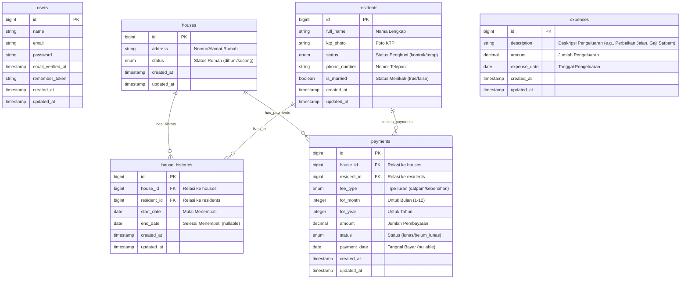

# Entity Relationship Diagram (ERD)

Berikut adalah desain database untuk sistem administrasi RT:

```mermaid
erDiagram
    users {
        bigint id PK
        string name
        string email
        string password
        timestamp email_verified_at
        string remember_token
        timestamp created_at
        timestamp updated_at
    }

    residents {
        bigint id PK
        string full_name "Nama Lengkap"
        string ktp_photo "Foto KTP"
        enum status "Status Penghuni (kontrak/tetap)"
        string phone_number "Nomor Telepon"
        boolean is_married "Status Menikah (true/false)"
        timestamp created_at
        timestamp updated_at
    }

    houses {
        bigint id PK
        string address "Nomor/Alamat Rumah"
        enum status "Status Rumah (dihuni/kosong)"
        timestamp created_at
        timestamp updated_at
    }

    house_histories {
        bigint id PK
        bigint house_id FK "Relasi ke houses"
        bigint resident_id FK "Relasi ke residents"
        date start_date "Mulai Menempati"
        date end_date "Selesai Menempati (nullable)"
        timestamp created_at
        timestamp updated_at
    }

    payments {
        bigint id PK
        bigint house_id FK "Relasi ke houses"
        bigint resident_id FK "Relasi ke residents"
        enum fee_type "Tipe Iuran (satpam/kebersihan)"
        integer for_month "Untuk Bulan (1-12)"
        integer for_year "Untuk Tahun"
        decimal amount "Jumlah Pembayaran"
        enum status "Status (lunas/belum_lunas)"
        date payment_date "Tanggal Bayar (nullable)"
        timestamp created_at
        timestamp updated_at
    }

    expenses {
        bigint id PK
        string description "Deskripsi Pengeluaran (e.g., Perbaikan Jalan, Gaji Satpam)"
        decimal amount "Jumlah Pengeluaran"
        date expense_date "Tanggal Pengeluaran"
        timestamp created_at
        timestamp updated_at
    }

    %% Relationships
    houses ||--o{ house_histories : "has_history"
    residents ||--o{ house_histories : "lives_in"
    
    houses ||--o{ payments : "has_payments"
    residents ||--o{ payments : "makes_payments"
```
