# PortalWarga - Sistem Manajemen Administrasi RT Premium

Sistem ini adalah aplikasi *full-stack* berbasis web untuk mempermudah tugas pengurus Rukun Tetangga (RT) di perumahan elite. Aplikasi ini dirancang untuk mendata warga, mengelola status hunian 20 unit rumah, mencatat pembayaran iuran rutin (Satpam & Kebersihan), serta membukukan laporan pengeluaran kas RT secara transparan dan mudah dipahami.

---

## Tech Stack & Arsitektur
- **Backend:** Laravel 11 (PHP 8.2+), RESTful API, MySQL.
- **Frontend:** React.js (Vite), React Router Dom, Axios, Vanilla CSS (Premium Glassmorphism UI).
- **Data Visualisasi:** Recharts (untuk Dashboard interaktif Bar & Area Chart).
- **Storage:** Local Public Disk (untuk penyimpanan *upload* Foto KTP warga).

---

## Panduan Instalasi Lengkap (Foolproof)
> **PENTING:** Ikuti panduan ini secara berurutan dan *copy-paste* perintah ke terminal Anda. Kehilangan satu langkah (terutama `storage:link` atau *seeding*) dapat menyebabkan aplikasi tidak berfungsi normal (seperti gambar KTP tidak muncul atau tidak bisa login).

### 1. Kebutuhan Sistem (Prerequisites)
Pastikan sistem komputer Anda sudah terinstal perangkat lunak berikut:
1. **PHP** (minimal versi 8.2).
2. **Composer** (untuk dependensi PHP).
3. **Node.js** (minimal versi 18) & **NPM**.
4. **MySQL Server** (bisa menggunakan XAMPP, WAMP, atau MySQL *standalone*).

### 2. Setup Backend (Laravel API)
Buka terminal (Command Prompt / PowerShell / Terminal) dan jalankan langkah berikut:

1. **Masuk ke folder backend:**
   ```bash
   cd backend
   ```

2. **Instal dependensi framework Laravel:**
   ```bash
   composer install
   ```

3. **Siapkan file konfigurasi `.env`:**
   ```bash
   copy .env.example .env
   ```
   *(Untuk pengguna Mac/Linux gunakan `cp .env.example .env`).*

4. **Konfigurasi Database MySQL:**
   - Pastikan aplikasi XAMPP/MySQL Anda sudah berjalan.
   - Buka aplikasi pengelolaan database Anda (seperti phpMyAdmin atau DBeaver) dan **buat sebuah database baru** (misalnya beri nama `portal_warga`).
   - Buka file `.env` di dalam folder `backend` menggunakan *text editor*.
   - Ubah konfigurasi database menjadi seperti ini:
     ```env
     DB_CONNECTION=mysql
     DB_HOST=127.0.0.1
     DB_PORT=3306
     DB_DATABASE=portal_warga
     DB_USERNAME=root
     DB_PASSWORD=
     ```

5. **Generate kunci keamanan aplikasi:**
   ```bash
   php artisan key:generate
   ```

6. **Lakukan Migrasi Database & Pengisian Data Awal (Seeding):**
   Langkah ini sangat krusial untuk membuat tabel dan mengisi akun admin, 20 unit rumah, serta simulasi penghuni dan pengeluaran awal.
   ```bash
   php artisan migrate:fresh --seed
   ```

7. **Hubungkan Folder Storage (Sangat Penting untuk Foto KTP):**
   Tanpa langkah ini, foto KTP yang diunggah warga tidak akan bisa ditampilkan di frontend.
   ```bash
   php artisan storage:link
   ```

8. **Jalankan Server Backend:**
   ```bash
   php artisan serve
   ```
   *Biarkan terminal ini tetap berjalan di background.* Server API berjalan di `http://localhost:8000`.

---

### 3. Setup Frontend (React UI)
Buka **jendela terminal baru** (biarkan terminal backend di atas tetap menyala), lalu jalankan:

1. **Masuk ke folder frontend:**
   ```bash
   cd frontend
   ```

2. **Instal dependensi JavaScript:**
   ```bash
   npm install
   ```

3. **Jalankan Server Frontend:**
   ```bash
   npm run dev
   ```
   Server antarmuka akan berjalan. Biasanya dapat diakses di `http://localhost:5173`.

---

### 4. Cara Menggunakan Aplikasi
Setelah kedua server (backend & frontend) berjalan:

1. Buka browser modern (Chrome/Edge/Firefox).
2. Kunjungi alamat: **`http://localhost:5173`**
3. Anda akan disambut halaman *Login*. Gunakan akses Admin (Ketua RT) berikut:
   - **Email:** `zan@mail.com`
   - **Password:** `zan12345`
4. Selamat! Anda sekarang berada di Dashboard Finansial RT.

---

## Relasi Database (ERD) Lengkap
Anda dapat melihat desain struktur database secara utuh pada file **[`ERD.md`](./ERD.md)** yang disertakan dalam repositori ini. Struktur ini mengatur tata letak tabel `users`, `residents`, `houses`, `house_histories` (riwayat hunian), `payments` (iuran), dan `expenses` (pengeluaran kas).

---

## Fitur Sesuai *Study Case*
- **Manajemen Penghuni:** Kelola KTP, nomor telepon, status kontrak/tetap, dan status nikah warga.
- **Manajemen 20 Unit Rumah:** Memantau rumah kosong/dihuni, menetapkan siapa warga yang menempati rumah tersebut (otomatis memutus riwayat penghuni lama jika diganti baru).
- **Pembayaran Iuran:** Mendata iuran bulanan Satpam (100k) & Kebersihan (15k). Tersedia mode *one-click* bayar 1 tahun penuh di muka.
- **Pengeluaran RT:** Mencatat biaya tak terduga (perbaikan selokan) maupun rutin (listrik/gaji satpam).
- **Pelaporan & Dashboard:** Statistik arus kas bulanan interaktif. Klik batang grafik untuk melihat rincian nota transaksi bulan tersebut.

---
**RANGKUMAN MANAJEMEN RT (PORTAL WARGA)**
---

## ERD (Entity Relationship Diagram)
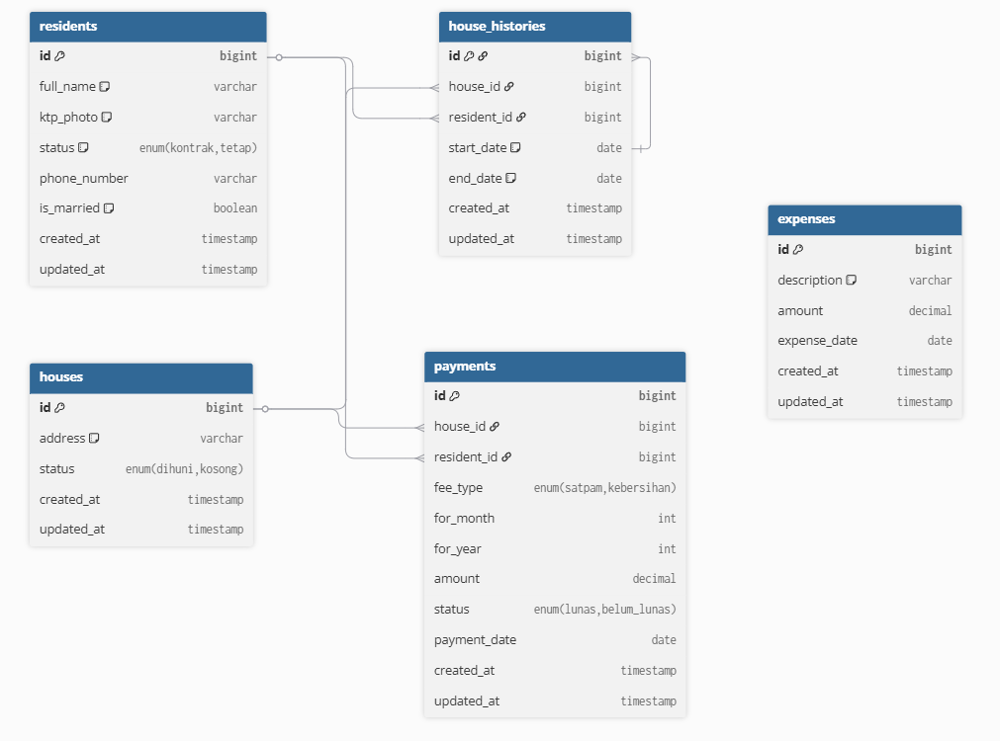
*Menampilkan skema database yang terdiri dari tabel residents, houses, house_histories, payments, dan expenses beserta relasi antar tabel.*

---

##  Proyek & Panduan
* **Repo Aplikasi (GitHub):**
 https://github.com/mafazann/PortalWarga
* **Panduan Instalasi:** https://github.com/mafazann/PortalWarga/blob/main/README.md

---

## Rangkuman
## Login Page
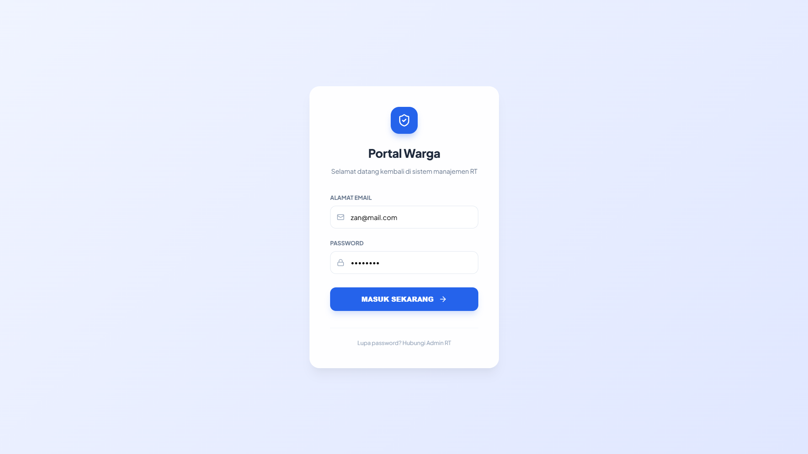
*Menampilkan halaman awal aplikasi untuk autentikasi Admin RT*

---

## Dashboard
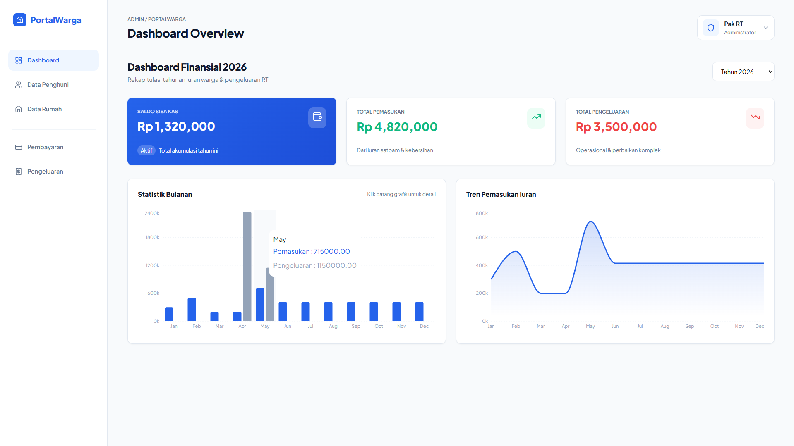

*Menampilkan ringkasan finansial utama tahun 2026 berupa bar chart "Statistik Bulanan" dan line chart "Tren Pemasukan Iuran".*

---

## Data Penghuni


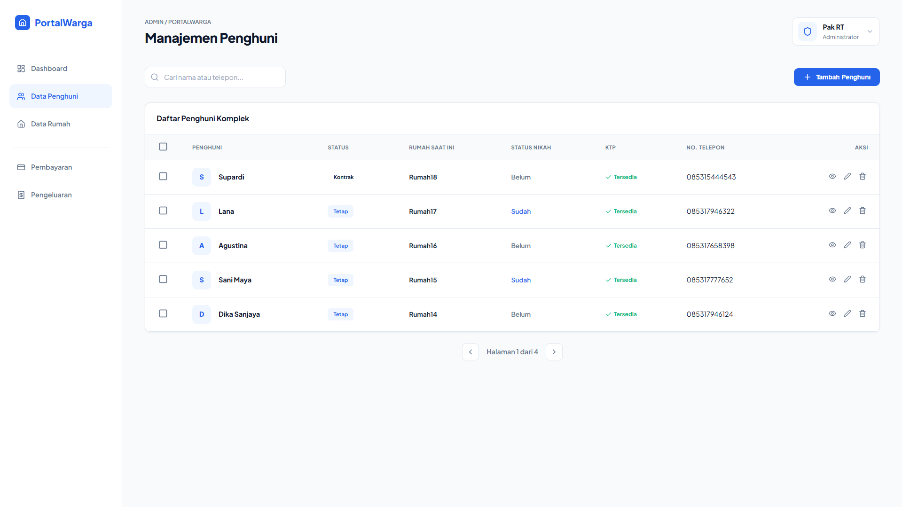
*Menampilkan Data Daftar Penghuni*
---
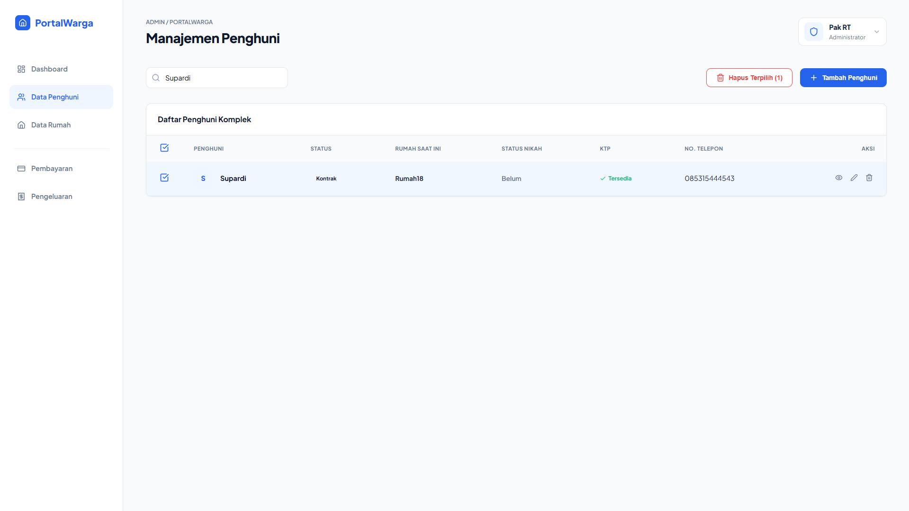
*Menampilkan Hasil Pencarian*
---

*Menampilkan Fitur Tambah Penghuni*
---
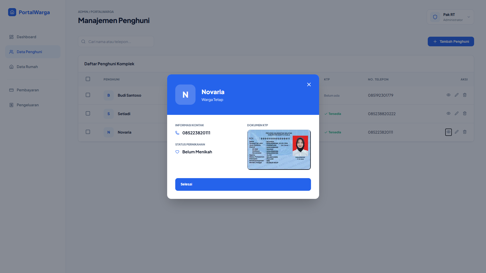
*Menampilkan Fitur Detail Penghuni*
---
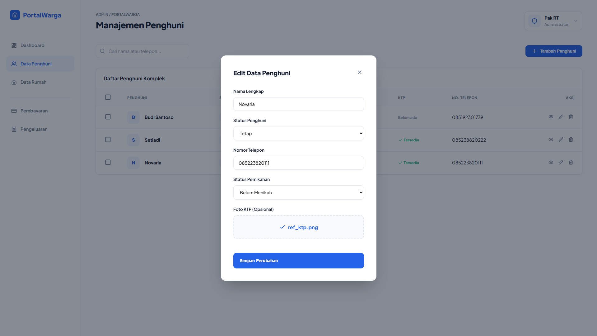
*Menampilkan Edit Data Penghuni*
---

---

## Data Rumah
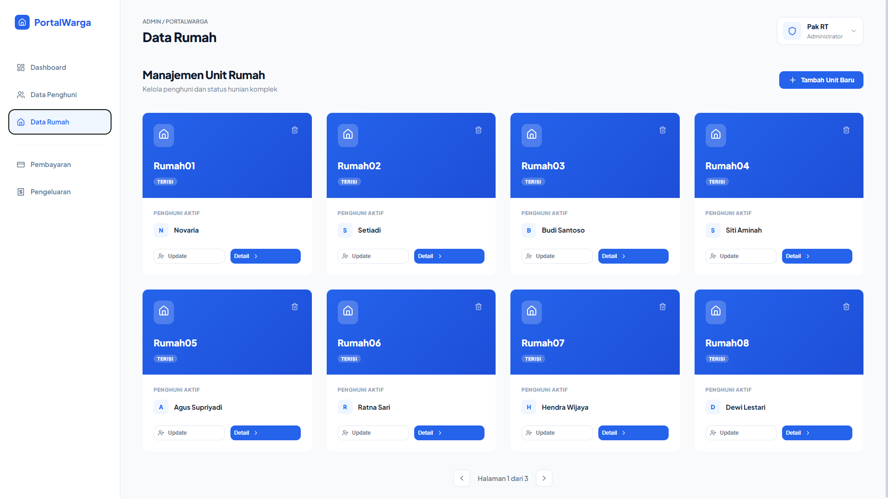
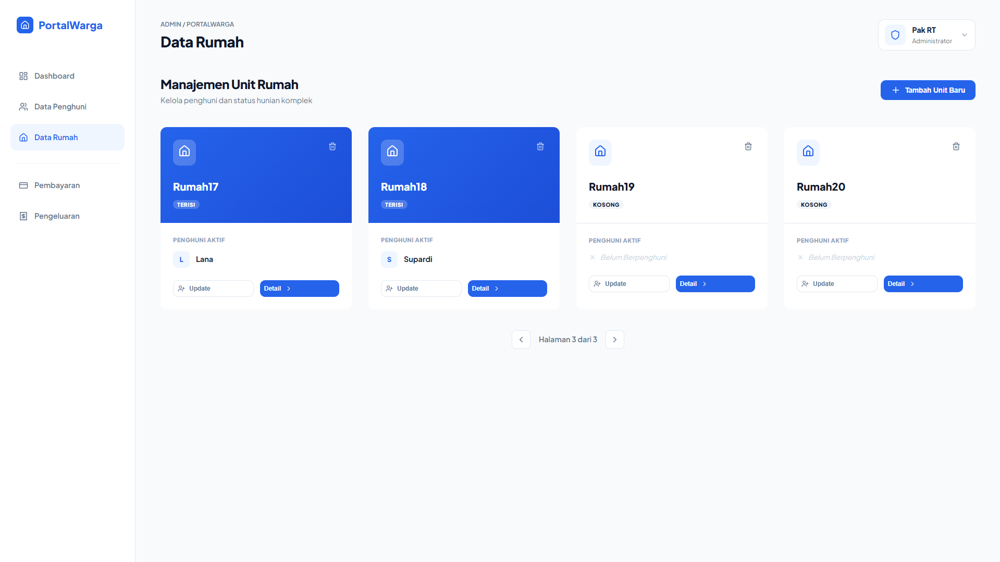
*Menampilkan Data Daftar Unit Rumah*
---
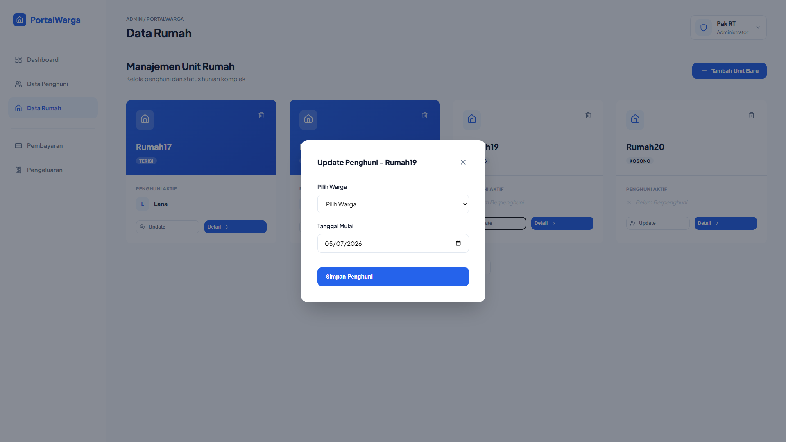
*Menampilkan Fitur Update Data Rumah*
---
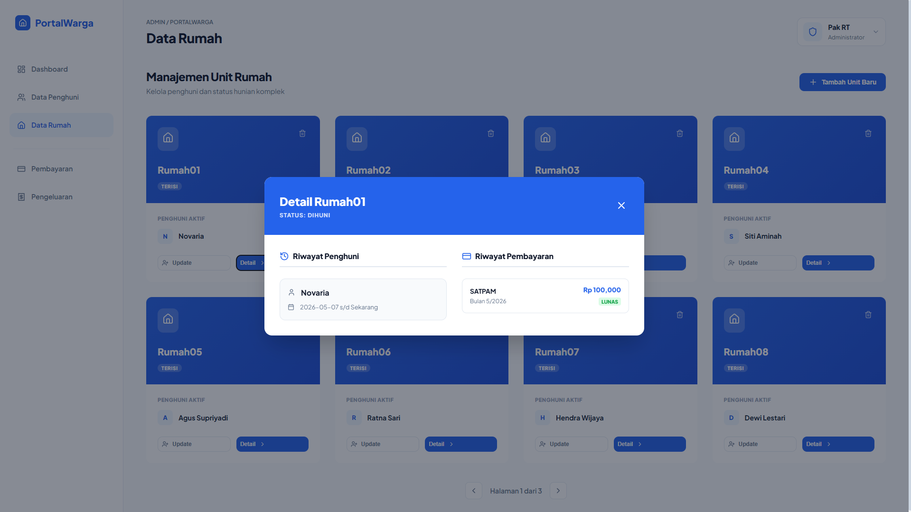
*Menampilkan Fitur Detail Rumah*
---
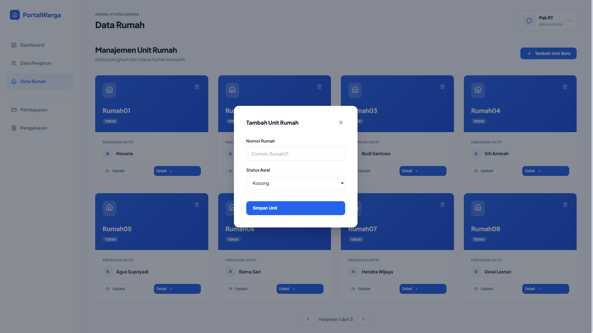
*Menampilkan Fitur Tambah Unit Rumah*

---

## Pembayaran

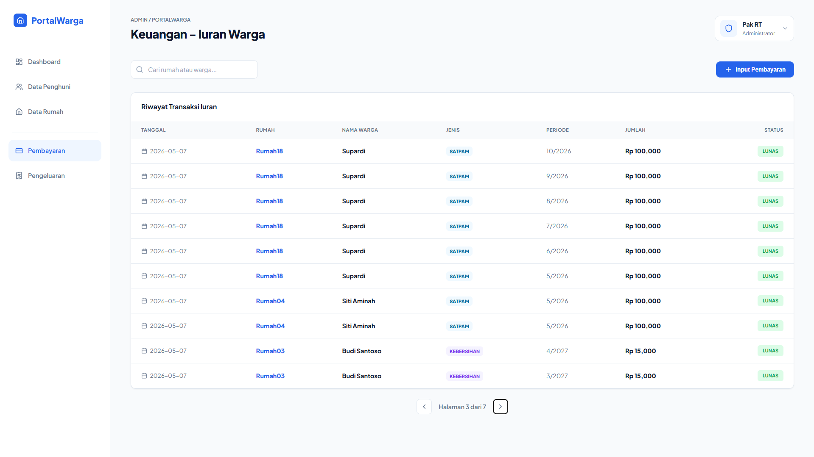
*Menampilkan Log Riwayat Transaksi Iuran*
---
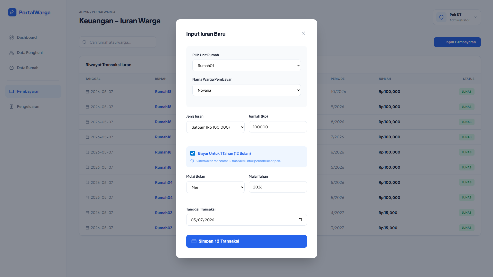
*Menampilkan pop-up formulir Iuran Baru*
---

---

## Pengeluaran
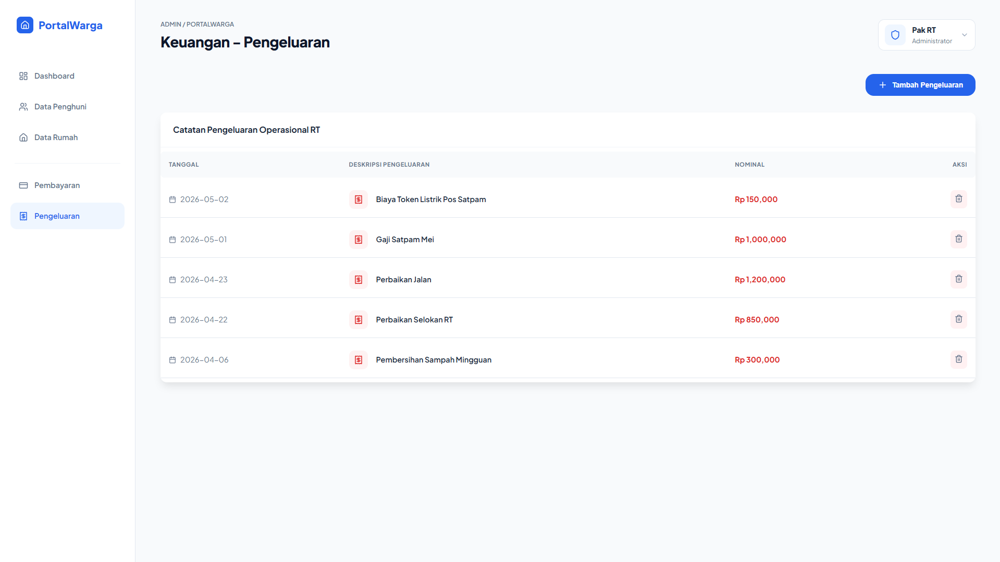
*Menampilkan Tabel Log Riwayat Transaksi Iuran*
---
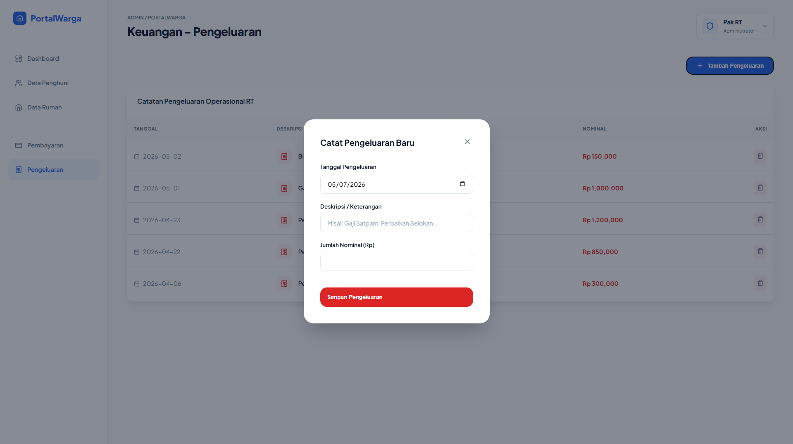
*Menampilkan pop-up formulir Catat Pengeluaran Baru*
---

---

## Profile & LogOut

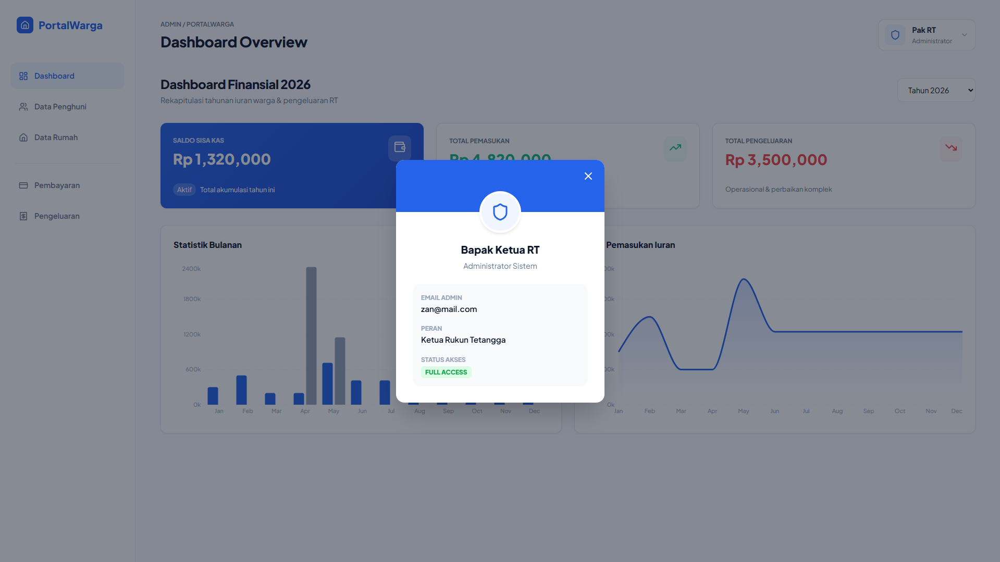
*Menampilkan Detail Profile Admin*


